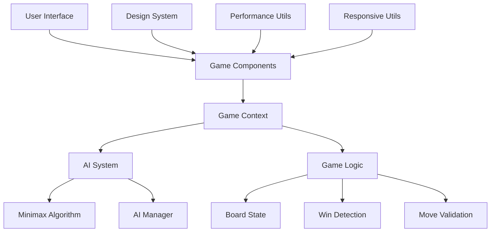

# 🏗️ Architecture Overview - Cyberpunk Connect Four

## System Architecture

### High-Level Overview



### Component Hierarchy

```
ModernBoard (Root)
├── GameProvider (Context)
│   ├── GameModeSelection
│   ├── GameContent
│   │   ├── ScoreBoard
│   │   ├── AIDifficultySelector
│   │   ├── GameStatus
│   │   ├── OptimizedGrid
│   │   │   └── OptimizedCell[]
│   │   └── GameControls
│   └── ErrorBoundary
```

## 🧩 Core Components

### ModernBoard.tsx
**Purpose**: Main game container and layout manager
- Provides global game context
- Handles game mode selection
- Manages cyberpunk visual theme
- Contains error boundaries

**Key Features**:
- Suspense boundaries for loading states
- Animated background particles
- Responsive layout system
- Error handling with fallbacks

### OptimizedGrid.tsx
**Purpose**: Game board rendering and interaction
- 7x6 grid layout with neon effects
- Cell interaction handling
- Victory animation system
- Performance optimizations

**Performance Optimizations**:
- Memoized grid comparison
- GPU-accelerated animations
- Optimized click handlers
- Responsive cell sizing

### OptimizedCell.tsx
**Purpose**: Individual game piece rendering
- Neon glow effects for player pieces
- Victory highlighting
- Interactive hover states
- Accessibility support

**Visual Features**:
- Energy core animations
- Holographic shine effects
- Circuit pattern overlays
- Victory particle effects

### ScoreBoard.tsx
**Purpose**: Futuristic HUD-style score display
- Player vs Player mode support
- Player vs AI mode with AI indicators
- Responsive layout adaptation
- Cyberpunk styling

### AIDifficultySelector.tsx
**Purpose**: Matrix-style AI difficulty selection
- Dropdown with hologram effects
- Four difficulty levels
- AI thinking state indicators
- Accessibility compliant

## 🤖 AI System Architecture

### AIManager.ts
**Responsibilities**:
- Difficulty level management
- AI personality definitions
- Performance optimization
- Move calculation timing

```typescript
interface DifficultyConfig {
  name: string;
  depth: number;
  description: string;
  icon: string;
  thinkingTime: number;
}
```

### Minimax Algorithm
**Implementation Details**:
- Alpha-beta pruning for performance
- Configurable search depth
- Position evaluation function
- Optimal move selection

**Performance Characteristics**:
- Easy: 1-2 moves lookahead
- Medium: 3-4 moves lookahead
- Hard: 5-6 moves lookahead
- Expert: 7+ moves lookahead

## 🎨 Design System

### Design Tokens (tokens.ts)
**Structure**:
```typescript
export const designTokens = {
  colors: {
    neon: { /* Electric colors */ },
    dark: { /* Background colors */ },
    cyber: { /* Surface colors */ }
  },
  typography: {
    fontFamily: { /* Cyberpunk fonts */ },
    fontSize: { /* Responsive scales */ }
  },
  spacing: { /* Consistent spacing */ },
  shadows: { /* Neon glow effects */ }
}
```

### Tailwind Configuration
**Custom Utilities**:
- Neon glow effects (`shadow-neon-*`)
- Cyberpunk animations (`animate-neon-pulse`)
- Gradient backgrounds (`bg-neon-gradient-*`)
- HUD panel styling (`hud-panel`)

### Animation System
**GPU Acceleration**:
- `transform: translateZ(0)` for hardware layers
- `will-change` optimization
- `backface-visibility: hidden`
- Optimized keyframe animations

## 📱 Responsive Architecture

### Breakpoint System
```typescript
const breakpoints = {
  xs: 0,      // Mobile portrait
  sm: 640,    // Mobile landscape
  md: 768,    // Tablet
  lg: 1024,   // Desktop
  xl: 1280,   // Large desktop
  '2xl': 1536 // Ultra-wide
}
```

### Device Detection
- Automatic device type detection
- Performance scaling based on capabilities
- Touch vs mouse interaction optimization
- Animation complexity adjustment

### Responsive Utilities
- Grid configurations per device
- Text scaling systems
- Spacing adaptations
- Layout transformations

## ⚡ Performance Architecture

### Optimization Strategies

#### Component Level
- React.memo with custom comparison
- useMemo for expensive calculations
- useCallback for stable function references
- Lazy loading with Suspense

#### Rendering Optimizations
- GPU hardware acceleration
- Animation frame scheduling
- Memory cleanup utilities
- Performance monitoring

#### Bundle Optimization
- Code splitting by route
- Dynamic imports for large components
- Tree shaking for unused code
- Compression with gzip/brotli

### Memory Management
```typescript
class PerformanceMonitor {
  measureFPS(): number
  shouldUseReducedMotion(): boolean
  enableGPUAcceleration(element: HTMLElement): void
  cleanupAnimations(elements: HTMLElement[]): void
}
```

## 🔄 State Management

### Game Context Architecture
```typescript
interface GameState {
  grid: Board;
  currentPlayer: Player;
  gameMode: GameMode;
  winner: Player | null;
  scores: PlayerScores;
  lastMove: Position | null;
  aiDifficulty: AIDifficulty;
  aiThinking: boolean;
}

interface GameActions {
  handleClick: (column: number) => void;
  resetGame: () => void;
  changeMode: () => void;
  setAIDifficulty: (difficulty: AIDifficulty) => void;
}
```

### State Updates
- Immutable state updates
- Optimistic UI updates
- AI move queuing
- Victory state management

## 🛡️ Error Handling

### Error Boundaries
- Component-level error catching
- Graceful fallback UI
- Error logging and reporting
- Recovery mechanisms

### Validation Layer
- Move validation before state updates
- Board state consistency checks
- AI calculation error handling
- Input sanitization

## 🔧 Build Architecture

### Next.js Configuration
- App Router for modern routing
- Standalone output for containerization
- Image optimization enabled
- Security headers configured

### Tailwind Integration
- Design token integration
- Custom utility classes
- Animation keyframes
- Responsive design utilities

### TypeScript Configuration
- Strict type checking
- Path mapping for imports
- Component prop validation
- AI algorithm type safety

## 📊 Monitoring & Analytics

### Performance Monitoring
- FPS tracking
- Memory usage monitoring
- Bundle size analysis
- Core Web Vitals measurement

### Health Checks
- API endpoint for monitoring
- Application status reporting
- Performance metrics exposure
- Error rate tracking

## 🚀 Deployment Architecture

### Multi-Platform Support
- Vercel (serverless)
- Docker containers
- Static hosting
- Self-hosted servers

### CI/CD Pipeline
- Automated testing
- Build optimization
- Security scanning
- Multi-environment deployment

### Scaling Considerations
- Horizontal scaling with load balancers
- CDN integration for static assets
- Database optimization for user data
- Caching strategies

---

This architecture provides a solid foundation for a modern, performant, and maintainable cyberpunk gaming experience while ensuring scalability and accessibility across all platforms.